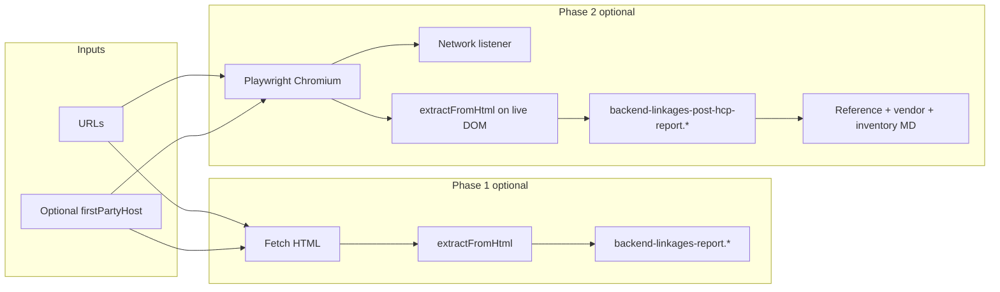

# Backend linkages scanner — guide for AI agents

This document describes **how the tool works end-to-end**, what it guarantees, what it does not do, and how to extend or invoke it safely. The implementation lives entirely under `tools/backend-linkages/`.

---

## Purpose

Given one or more **HTTPS page URLs**, the scanner identifies:

1. **Third-party origins** — hostnames that are not the scanned site’s first-party host (and not subdomains of that host treated as same-org).
2. **Concrete third-party URLs** — when they appear as extractable strings in HTML (attributes, quoted URLs, protocol-relative URLs, etc.).
3. **AEM-style `/bin/...` paths** — servlet or endpoint paths referenced in markup.
4. **Runtime network traffic** (Playwright only) — HTTP(S) request targets to third-party hosts while the page runs in headless Chromium.

Outputs are JSON + Markdown files written to a directory (default under `site-urls/<slug>/`).

---

## High-level pipeline



Entry point: `tools/backend-linkages/scan.mjs`.

- **`runBackendLinkagesScan(opts)`** — programmatic API; requires `outDir`; requires `url` or `urls` unless `referenceOnly: true`.
- **CLI** — `npm run scan -- --url "https://..."` (same as `npm run scan:linkages`).

Execution order when both phases run:

1. Create output directory; write `urls-all.json` and placeholder `third-party-implementation-deep-dive.md`.
2. **Fetch phase** (unless `--skip-fetch`): for each URL, `fetch()` HTML → `extractFromHtml` → `backend-linkages-report.json` + `.md`.
3. **Playwright phase** (unless `--skip-playwright`): launch Chromium, for each URL navigate → optional consent clicks → wait → read `page.content()` + merge network hosts → `backend-linkages-post-hcp-report.json` + `.md`, then three derived Markdown files (see below).

---

## First-party vs third-party (`lib/context.mjs`)

`createScanContext(pageUrl, firstPartyHostOverride)` derives:

| Field / function | Meaning |
|------------------|---------|
| `HOST` | Lowercase hostname from the **first** URL in the list, or `firstPartyHostOverride` if provided. |
| `isOrgRoutingHost(h)` | `h === HOST` or `h.endsWith('.' + HOST)` — treated as first-party (subdomains of the scanned host). |
| `isThirdPartyHost(h)` | Not `HOST` and not org-routing — used for **network filtering** in Playwright. |

**Agent implication:** Related corporate domains (e.g. `www.example.com` vs `app.example.com` on another apex) are **third-party** unless they match `HOST` or `*.HOST`. Use `--first-party-host` only when you intentionally want a different apex treated as first-party.

---

## HTML extraction (`lib/extract.mjs`)

`extractFromHtml(html, ctx)` returns three sets:

### `thirdParty` (absolute URLs, query stripped)

- Regex on common attributes: `src`, `href`, `data-src`, `poster`, `action` with `http://`, `https://`, or `//` hosts.
- Additional quoted strings / `url:` patterns for:
  - Absolute `https?://...`
  - Same-origin paths like `url: "/bin/..."` (resolved to `https://HOST/bin/...` for host classification).
  - Protocol-relative `//host/...` (normalized to `https://host/...`).
- Excludes: `HOST`, `*.HOST`, `www.w3.org`.

### `patterns`

One entry per distinct third-party **host** found among `thirdParty` URLs:  
`Third-party origin in extracted markup: <hostname>`  
(There is **no** separate vendor keyword list in extraction; patterns mirror discovered URL hosts.)

### `binPaths`

- Paths starting with `/bin/` from the string scanner and from `["'](\/bin\/...)` matches in HTML (path traversal `..` rejected).

### `integrationLabel(urlOrPath, ctx)`

- If URL resolves to `HOST` + path starting with `/bin/` → `AEM servlet: <pathname>`.
- Otherwise → `Third-party: <hostname><path-prefix>` (short path truncation).

**Agent implication:** Tags injected only via opaque minified JS without URLs in HTML may be **invisible** to fetch/HTML extraction until Playwright’s **network** phase catches their requests.

---

## Fetch phase (`lib/fetch-report.mjs`)

- Uses Node **`fetch`** with a desktop Chrome-like `User-Agent`, `Accept` for HTML, `redirect: 'follow'`, **45s** timeout.
- Skips URLs ending in `.pdf`.
- Requires `content-type` to look like HTML for extraction; otherwise records status/note with empty extraction.
- Integration keys in the report include:
  - `Third-party URL: <url>` (fetch) — note Playwright uses the label `Third-party URL (HTML):` for the same conceptual thing.
  - Pattern lines from `extractFromHtml`.
  - `AEM servlet: /bin/...` from `integrationLabel`.

**Limitations (explicit):** No JavaScript execution, no cookies beyond redirect cookies, no consent dismissal — “post-consent” behavior does **not** apply here. Report note: *Fetch-only; no cookie dismissal; runtime tags may be missing.*

---

## Playwright phase (`lib/playwright-report.mjs`)

### Launch

- `chromium.launch({ headless: true })`, new context with `locale: 'en-US'`, fixed desktop `userAgent`, `ignoreHTTPSErrors: false`.

### Per URL

1. `page.goto(url, { waitUntil: 'domcontentloaded', timeout })`  
   - Default timeout **55000 ms**; override with env `SCAN_GOTO_MS`.
2. Wait **1400 ms** (`SCAN_PRE_CLICK_MS`).
3. **`dismissCookieOrConsentBanner(page)`** — tries known CSS IDs (OneTrust, etc.) then role/name-based button locators (English + a few EU strings). Returns boolean; **two** attempts with an extra **1000 ms** between if the first fails.
4. Wait **4000 ms** (`SCAN_POST_CLICK_MS`) so tag managers can fire after consent.
5. `page.content()` → same `extractFromHtml` as fetch.
6. **Network:** from page load onward, `page.on('request', ...)` records third-party hosts (`isThirdPartyHost`) and up to **20** sample path+query snippets per host (pathname truncated, query shown as `?…`).

### Merge

- **`mergedThirdPartyHosts`**: sorted union of hosts from HTML-derived URLs **and** network-only hosts.

### Errors

- Failures are caught per page; `byPage` may include `error`, partial `networkHosts`, and `finalUrl` when available.

**Environment variables (optional):**

| Variable | Default | Role |
|----------|---------|------|
| `SCAN_GOTO_MS` | `55000` | Navigation timeout |
| `SCAN_PRE_CLICK_MS` | `1400` | Wait before consent heuristics |
| `SCAN_POST_CLICK_MS` | `4000` | Wait after consent attempt for tags |

**Agent implication:** Consent UX varies by market; if `bannerOrConsentClicked` is `no`, late-loaded pixels may still appear from network, but some stacks only load after a specific click the heuristics miss. Extend `dismissCookieOrConsentBanner` in `playwright-report.mjs` if a site needs new selectors.

**Runtime requirement:** Chromium must be installed (`npx playwright install chromium`). Sandboxed or headless-broken environments may need running outside restrictive sandboxes.

---

## Markdown generators

All consume the **Playwright** JSON report (`hostsAggregated`, `byPage`, `uniqueIntegrations`, etc.) unless in `--reference-only` mode.

| Module | Output file | Role |
|--------|-------------|------|
| `lib/reference-markdown.mjs` | `third-party-integrations-reference.md` | Long-form reference; uses **integration catalog** for section titles where hosts match. |
| `lib/vendor-markdown.mjs` | `integrations-vendors-and-proof.md` | Vendor-oriented proof listing. |
| `lib/host-inventory-markdown.mjs` | `third-party-hosts-inventory.md` | **Catalog-free** complete hostname list + samples. |

### Integration catalog (`lib/integration-catalog.mjs`)

- **`getIntegrationCatalog(HOST)`** returns a curated list of vendor entries with `matchHost(hostname)` for **narrative grouping** in reference/vendor Markdown.
- **Discovery is not driven by the catalog:** unknown hosts still appear in JSON, post-hcp Markdown tables, and **`third-party-hosts-inventory.md`**.
- **Agent implication:** Editing the catalog changes prose sections, not whether a host is “detected.”

---

## CLI flags (`scan.mjs` → `parseArgs`)

| Flag | Effect |
|------|--------|
| `--url <url>` | Required for normal runs (single URL). |
| `--out <dir>` | Output directory; default `site-urls/<slug-from-url>/`. |
| `--first-party-host <host>` | Override `HOST` for first/third-party classification. |
| `--skip-fetch` | Skip fetch phase and fetch report files. |
| `--skip-playwright` | Skip browser; no post-hcp JSON/MD, no inventory/reference/vendor from Playwright. |
| `--reference-only` | Requires `--out` pointing at a folder that already has **`backend-linkages-post-hcp-report.json`**; regenerates the three Markdown files from JSON only (no network re-run). |

---

## Output files (typical full run)

| File | Produced when |
|------|----------------|
| `urls-all.json` | Always (lists input URLs). |
| `third-party-implementation-deep-dive.md` | Always (stub for human notes). |
| `backend-linkages-report.json` / `.md` | Fetch not skipped. |
| `backend-linkages-post-hcp-report.json` / `.md` | Playwright not skipped. |
| `third-party-hosts-inventory.md` | Playwright not skipped, or `--reference-only`. |
| `third-party-integrations-reference.md` | Same. |
| `integrations-vendors-and-proof.md` | Same. |

---

## What this tool does **not** do

- No deep parsing of arbitrary third-party **JavaScript source** to find hidden endpoints.
- No login flows, MFA, or credential-based sessions unless the URL is already a fully authorized deep link.
- No guarantee of matching real-user consent state in every jurisdiction.
- No server-side crawl of the whole site — only explicitly provided URLs (today’s CLI passes one URL; the API accepts `urls: string[]`).

---

## Programmatic usage

```javascript
import { runBackendLinkagesScan } from './tools/backend-linkages/scan.mjs';

await runBackendLinkagesScan({
  urls: ['https://example.com/a', 'https://example.com/b'],
  outDir: 'site-urls/my-batch',
  skipFetch: false,
  skipPlaywright: false,
});
```

`createScanContext` is re-exported from `scan.mjs` for tests or custom tooling.

---

## File map (for navigation)

| Path | Responsibility |
|------|------------------|
| `tools/backend-linkages/scan.mjs` | CLI, orchestration, slug default `outDir`, `reference-only` branch. |
| `tools/backend-linkages/lib/context.mjs` | `HOST`, first/third-party helpers. |
| `tools/backend-linkages/lib/extract.mjs` | HTML → URLs, patterns, `/bin/` paths, labels. |
| `tools/backend-linkages/lib/fetch-report.mjs` | Fetch-only scan + Markdown. |
| `tools/backend-linkages/lib/playwright-report.mjs` | Browser scan, consent heuristics, network merge + Markdown. |
| `tools/backend-linkages/lib/integration-catalog.mjs` | Optional vendor taxonomy for reference MD. |
| `tools/backend-linkages/lib/reference-markdown.mjs` | Reference MD builder. |
| `tools/backend-linkages/lib/vendor-markdown.mjs` | Vendor proof MD builder. |
| `tools/backend-linkages/lib/host-inventory-markdown.mjs` | Catalog-free host inventory MD. |

---

## Dependencies

- **Runtime:** Node.js with native `fetch` (modern Node).
- **npm package:** `playwright` (Chromium) for the browser phase only.

When assisting users, prefer documenting **`npm run scan -- --url "..."`** and Playwright install steps from the root `README.md`.
